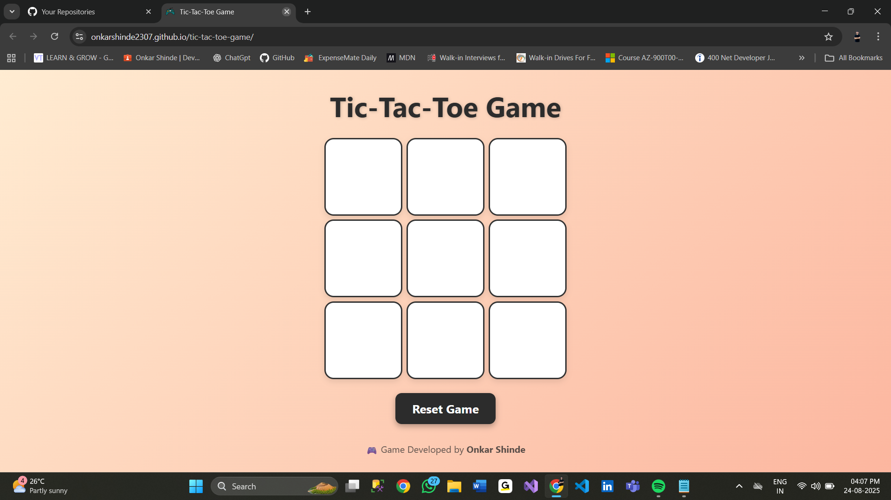

# 🎮 Tic-Tac-Toe Game  

A **fun & interactive Tic-Tac-Toe game** built using **HTML, CSS, and JavaScript**!  
Challenge your friend in this timeless classic, enjoy a smooth UI, and relive the nostalgic X vs O battles.  

✨ Simple to play. 🎨 Beautifully designed. ⚡ Runs right in your browser.  

---

## 🚀 Features  
- 🎨 **Modern & Responsive UI** – Play on any device  
- 🕹️ **Two-Player Mode** – Compete with your friend  
- 🏆 **Winner / Draw Announcement** – Instant results after each game  
- 🔄 **New Game & Reset Options** – Restart anytime  
- 🎭 **Custom Styling with Emojis** – Fun twist to the classic game  

---

## 🛠️ Technologies Used  
- ⚡ **HTML5** → Structure  
- 🎨 **CSS3** → Styling & Layout  
- 🧠 **JavaScript (ES6)** → Game Logic & Interactivity  

---

## 📂 Project Structure  
📦 tic-tac-toe-game
┣ 📜 index.html # Main HTML file
┣ 📜 style.css # Styling
┣ 📜 script.js # Game logic
┗ 📜 README.md # Project details

yaml
Copy
Edit

---

## 🎯 How to Play  
1. Open the game in your browser 🌐  
2. Player 1 👉 `X` & Player 2 👉 `O`  
3. Click on the grid to place your mark 🖱️  
4. The game announces the **winner 🏆** or **draw 🤝**  
5. Use **New Game** or **Reset** to start again 🔄  

---

## 📸 Preview  
Here’s a glimpse of the game interface 👇  

  

*(Make sure your screenshot `GamePage.png` is placed in the project root so it shows up here!)*  

---

## 🌐 Live Demo  
🔥 Play it here → [Tic-Tac-Toe Live Game](https://onkarshinde2307.github.io/tic-tac-toe-game/)  

---

## 👨‍💻 Developer  
Made with ❤️ by **Onkar Shinde**  
